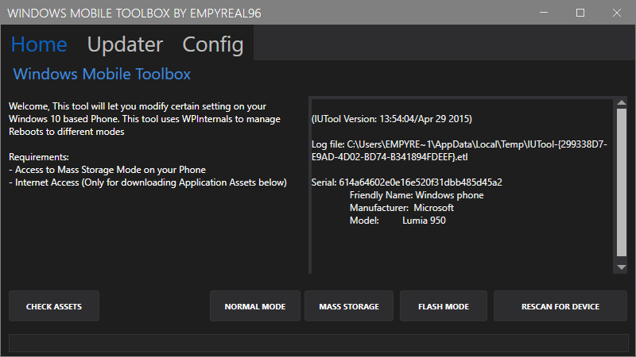
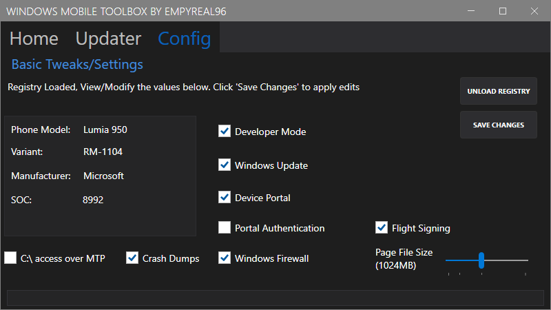
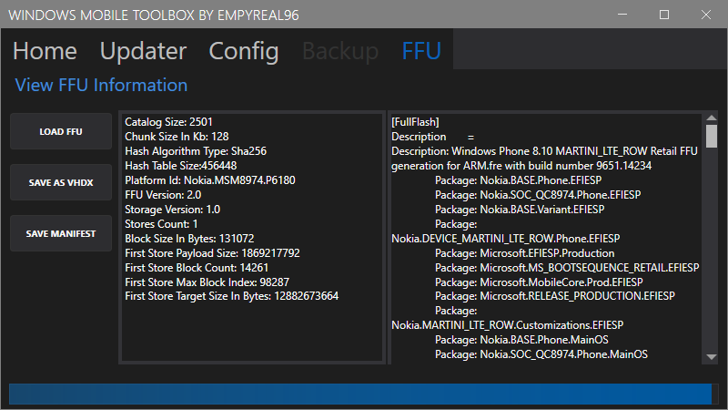

# Windows 10 Mobile Toolbox

A desktop tool to help with various task and configurations with Windows Phones

 

### Updated:
Added:
- Backup your Phone's whole disk and/or MainOS,Data and EFIESP
- Convert WP8 FFU files to `.vhdx` (W10M FFUs not currently supported)

(NOTE: Disk reading is slow on my tests, I plan to look at improving this. Also there way be a few bugs, this is my first time using disk management.)

# What can it do?
### General:
- Manage booting into different states (Flash, Mass Storage and Normal)
- Push Updates to your device (10549 > 15254)

### Modify Device Settings:
 - Windows Update
 - Windows Firewall
 - Page File
 - Dev Mode
 - Device Portal
 - C:\ MTP Access
 - Local Crash Dumps
 - Flight Signing

More to be added

## Notes:

- Third party tools are used with this tool, all rights reserved to the owners.
- This tool includes "iutool" suite and "thor2.exe"
- WPInternals is required to automate various tasks, the latest will be downloaded through the app, and saved in the apps's data folder
