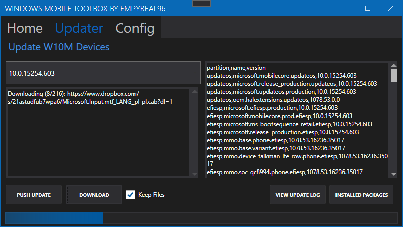

# Windows 10 Mobile Toolbox

A desktop tool to help with various task and configurations with Windows Phones

### Updated:
Added:
- Modify Page File size
- Failsafe for if the reg file is already mounted (in case the app crashes while hives mounted)
- Debug messages
- Device Portal on/off and Auth
- Developer Mode config
- Windows Firewall Config
- Fixes to reading Reg Keys to avoid null returns
- Windows Update settings
- Flight Signing enabler

# What can it do?
### General:
- Manage booting into different states (Flash, Mass Storage and Normal)
- Push Updates to your device (10549 > 15254)

### Modify Device Settings:
 - Windows Update
 - Windows Firewall
 - Page File
 - Dev Mode
 - Device Portal
 - C:\ MTP Access
 - Local Crash Dumps
 - Flight Signing

More to be added

## Notes:

- Third party tools are used with this tool, all rights reserved to the owners.
- This tool includes "iutool" suite and "thor2.exe"
- WPInternals is required to automate various tasks, the latest will be downloaded through the app, and saved in the apps's data folder
